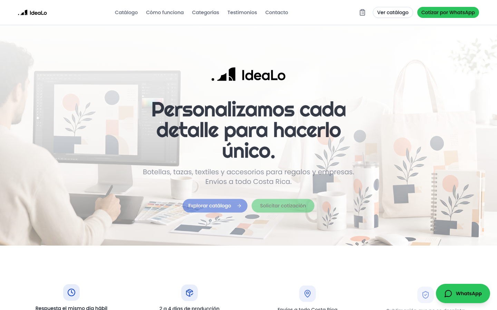
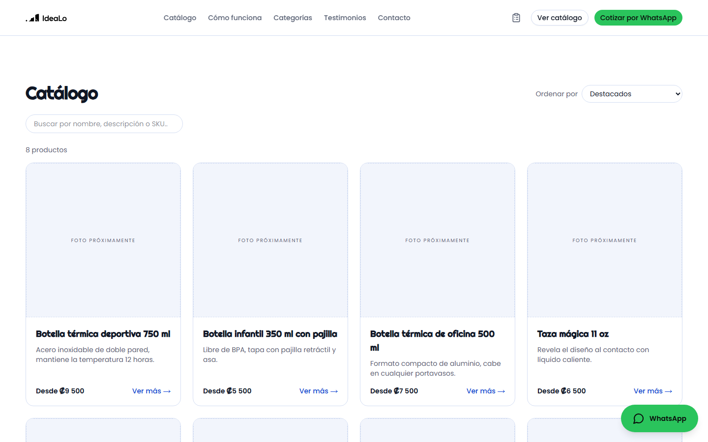
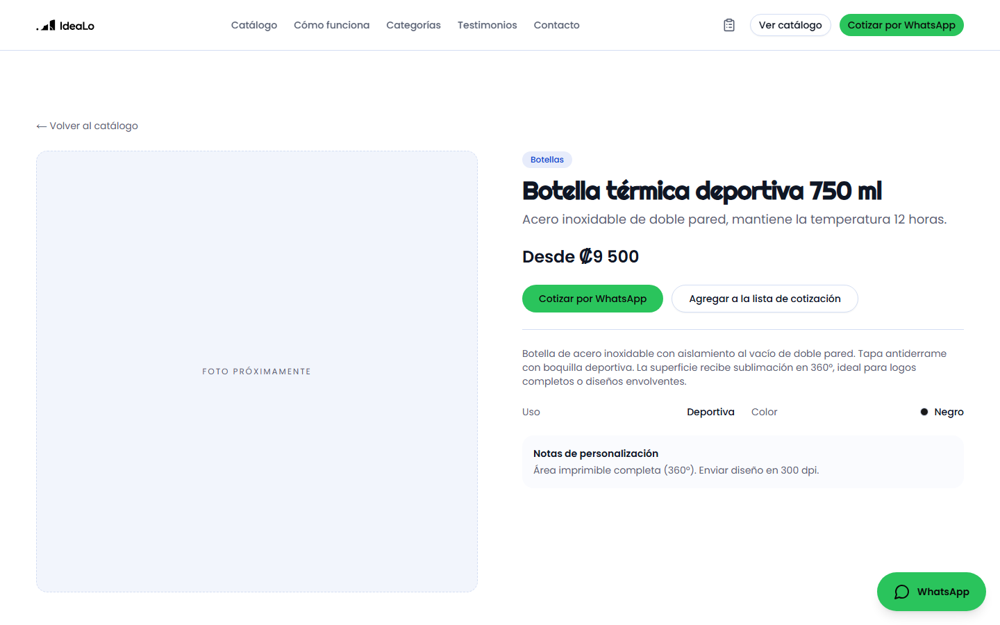
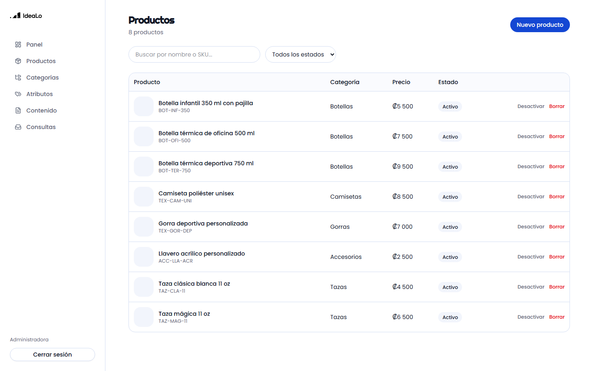
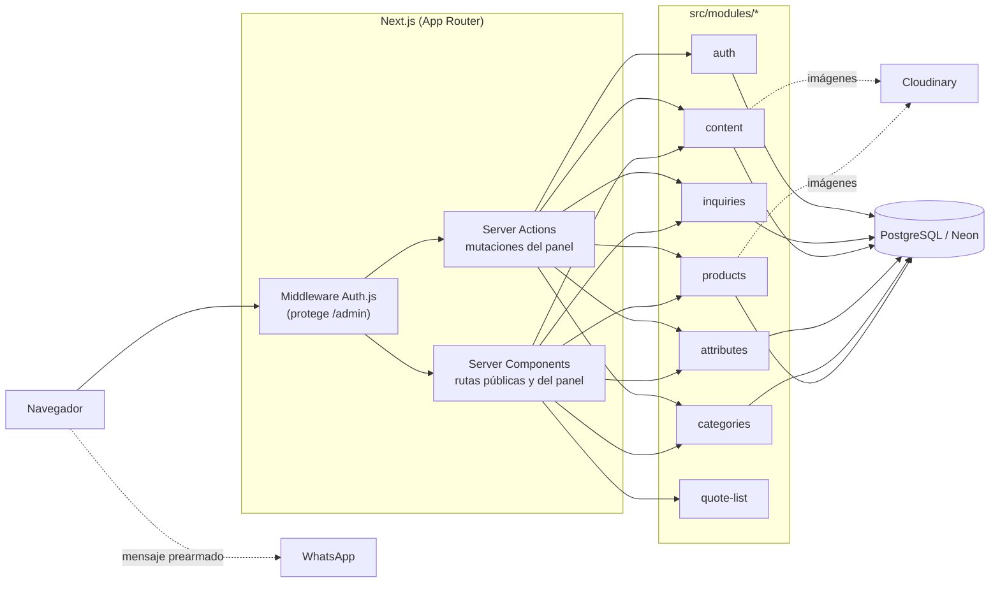

# Catálogo digital de sublimación

Plataforma web para un emprendimiento de sublimación en funcionamiento. Sustituye la atención manual por mensajería —enviar fotos una por una, repetir precios, explicar opciones— por un catálogo navegable con panel de administración autogestionable.



---

## El problema

El negocio gestionaba todo su catálogo por WhatsApp: cada consulta implicaba reenviar fotografías, repetir descripciones y explicar el proceso de personalización desde cero. El tiempo invertido en consultas repetitivas crecía con las ventas y no escalaba.

## La solución

Un catálogo digital público con filtrado por características, más un panel privado desde el que la dueña actualiza productos, imágenes y contenido sin tocar código. La conversión sigue ocurriendo por WhatsApp, pero el cliente llega con el producto ya elegido y un mensaje pre-armado.

| Catálogo con filtros                                     | Ficha de producto                                         | Panel de administración                                     |
| -------------------------------------------------------- | --------------------------------------------------------- | ----------------------------------------------------------- |
|  |  |  |

No hay despliegue público todavía (dominio y hosting quedan fuera de este repositorio, ver Fase 5.8 en el roadmap). Para verlo en funcionamiento, seguí la sección [Instalación](#instalación).

## Funcionalidades

- Catálogo con categorías, filtros por características combinables y buscador
- Ficha de producto con galería, detalles de personalización y contacto directo
- Lista de cotización: el cliente agrupa varios productos y genera un solo mensaje
- Panel de administración protegido con CRUD completo de productos, categorías, atributos e imágenes
- Contenido editable (hero, FAQ, testimonios, galería, datos de contacto) sin despliegues
- Bandeja de consultas con estado y notas internas para medir qué productos generan interés real
- SEO técnico: metadatos por página, sitemap, datos estructurados (JSON-LD) y Open Graph
- Diseño responsive y accesible (navegación por teclado, roles ARIA en el menú móvil)

## Stack

| Capa          | Tecnología                                      |
| ------------- | ----------------------------------------------- |
| Framework     | Next.js 16 (App Router) · TypeScript            |
| Estilos       | Tailwind CSS · Radix UI                         |
| Base de datos | PostgreSQL (Neon) · Prisma ORM                  |
| Autenticación | Auth.js v5                                      |
| Imágenes      | Cloudinary                                      |
| Validación    | Zod · React Hook Form                           |
| Calidad       | ESLint · Prettier · Husky · Vitest · Playwright |
| CI            | GitHub Actions                                  |

## Arquitectura

El proyecto se organiza por **módulos de dominio** en lugar de por tipo de archivo. Cada módulo es autocontenido y solo depende de `shared/`, de modo que agregar carrito, pagos o inventario no requiere tocar los módulos existentes.



Cada módulo sigue la misma forma interna:

```
src/
├── app/
│   ├── (public)/               # inicio, catálogo, producto, contacto, lista de cotización
│   ├── admin/
│   │   ├── (auth)/             # /admin/login, fuera del middleware de sesión
│   │   └── (panel)/            # productos, categorías, atributos, contenido, consultas
│   ├── sitemap.ts · robots.ts
│   └── api/
├── modules/
│   ├── products/
│   │   ├── schema.ts           # validación con Zod (se reutiliza en cliente y servidor)
│   │   ├── repository.ts       # único punto de acceso a Prisma del módulo
│   │   ├── service.ts          # lógica de negocio, valida entrada con schema.ts
│   │   ├── actions.ts          # Server Actions
│   │   └── components/
│   ├── categories/
│   ├── attributes/
│   ├── content/                # FAQ, testimonios, galería, ajustes del sitio
│   ├── inquiries/               # bandeja de consultas de contacto
│   ├── auth/
│   └── quote-list/
├── shared/
│   ├── ui/                     # componentes reutilizables
│   ├── lib/                    # cliente Prisma (singleton), Cloudinary, JSON-LD, utilidades
│   └── hooks/
prisma/
├── schema.prisma
├── seed.ts
└── migrations/
e2e/                             # recorridos Playwright (público y de administración)
docs/
└── adr/                        # decisiones de arquitectura documentadas
```

**Un módulo nunca importa de otro módulo.** Si dos módulos necesitan lo mismo, va en `shared/`. `repository.ts` es el único archivo de cada módulo que puede importar Prisma; componentes y Server Actions pasan siempre por `service.ts`.

Las decisiones técnicas relevantes están documentadas en [`docs/adr/`](docs/adr/).

## Modelo de datos

La decisión central es el **modelo híbrido de categorías y atributos**. Las categorías forman un árbol de máximo dos niveles que responde a _qué es_ el producto (Botellas, Tazas, Textiles → Camisetas). Las características transversales —material, capacidad, uso, color, talla— son **atributos**, no subcategorías, porque se combinan libremente: una botella puede ser térmica, deportiva y de acero inoxidable a la vez, sin duplicar registros ni anidar categorías artificiales.

`CategoryAttribute` define qué filtros se muestran en cada categoría, de modo que la vista de textiles ofrece tallas y la de botellas ofrece capacidad. El filtrado combina valores del mismo atributo con OR y atributos distintos con AND — ver [ADR 0001](docs/adr/0001-categorias-vs-atributos.md) para el razonamiento completo y `buildProductWhere` en [`src/modules/products/repository.ts`](src/modules/products/repository.ts) para la consulta.

Ver [`prisma/schema.prisma`](prisma/schema.prisma) para el esquema completo.

## Instalación

Requiere Node.js 20 o superior y una base de datos PostgreSQL.

```bash
git clone https://github.com/usuario/repositorio.git
cd repositorio
npm install

cp .env.example .env.local
# completá las variables

npm run db:migrate
npm run db:seed

npm run dev
```

El sitio queda en `http://localhost:3000` y el panel en `/admin/login`. Las credenciales iniciales son las definidas en `SEED_ADMIN_EMAIL` y `SEED_ADMIN_PASSWORD`.

## Variables de entorno

Todas están descritas en [`.env.example`](.env.example).

| Variable                                             | Descripción                                                                                                      |
| ---------------------------------------------------- | ---------------------------------------------------------------------------------------------------------------- |
| `DATABASE_URL`                                       | Cadena de conexión a PostgreSQL (con pooling)                                                                    |
| `DIRECT_URL`                                         | Conexión sin pooling, requerida por las migraciones                                                              |
| `AUTH_SECRET`                                        | Secreto de sesión (`openssl rand -base64 32`)                                                                    |
| `AUTH_URL`                                           | URL base para Auth.js                                                                                            |
| `CLOUDINARY_CLOUD_NAME` / `_API_KEY` / `_API_SECRET` | Credenciales de servidor para Cloudinary                                                                         |
| `NEXT_PUBLIC_CLOUDINARY_CLOUD_NAME` / `_API_KEY`     | Habilitan la carga de imágenes desde el panel (opcionales: sin ellas, el panel funciona pero sin subir imágenes) |
| `NEXT_PUBLIC_WHATSAPP_NUMBER`                        | Número en formato internacional sin `+`                                                                          |
| `NEXT_PUBLIC_SITE_URL`                               | URL pública del sitio (metadatos, sitemap, JSON-LD)                                                              |
| `NEXT_PUBLIC_SITE_NAME`                              | Nombre del emprendimiento, usado en textos por defecto                                                           |
| `NEXT_PUBLIC_GA_MEASUREMENT_ID`                      | Opcional: activa Google Analytics 4                                                                              |
| `NEXT_PUBLIC_GOOGLE_SITE_VERIFICATION`               | Opcional: verificación de Google Search Console                                                                  |
| `SEED_ADMIN_EMAIL` / `SEED_ADMIN_PASSWORD`           | Credenciales de la cuenta administradora que crea el seed                                                        |

## Pruebas

- **Unitarias** (Vitest): lógica pura sin efectos secundarios — la construcción del `where` de Prisma para el filtrado multifaceta, los esquemas Zod y utilidades como la generación de enlaces de WhatsApp. `npm run test:coverage` genera el reporte de cobertura.
- **End-to-end** (Playwright): dos recorridos completos contra una compilación de producción real — el recorrido público (inicio → filtrar catálogo → ficha de producto → WhatsApp) y el recorrido de administración (login → crear producto → verlo publicado). No se mockea la base de datos.
- **CI**: cada push y Pull Request corre formato, lint, tipos, pruebas unitarias con cobertura, migración y siembra contra un contenedor de PostgreSQL descartable, build de producción y las pruebas end-to-end. Ver [`.github/workflows/ci.yml`](.github/workflows/ci.yml).

```bash
npm run test            # unitarias
npm run test:coverage   # unitarias con cobertura
npm run test:e2e        # end-to-end (requiere build de producción)
```

## Scripts

```bash
npm run dev             # servidor de desarrollo
npm run build           # compilación de producción
npm run start           # servidor de producción (tras build)
npm run lint            # ESLint
npm run typecheck       # verificación de tipos
npm run test            # Vitest
npm run test:coverage   # Vitest con cobertura
npm run test:e2e        # Playwright
npm run db:migrate      # aplicar migraciones (desarrollo)
npm run db:seed         # poblar datos iniciales
npm run db:studio       # explorador visual de la base
```

## Flujo de trabajo

Rama por tarea (`feat/`, `fix/`, `chore/`, `docs/`), un Pull Request por rama, revisión antes de integrar a `main`. Los commits siguen [Conventional Commits](https://www.conventionalcommits.org/) en español, validados automáticamente por commitlint.

```
feat/catalogo-filtros
fix/imagen-movil
chore/configuracion-eslint
docs/adr-categorias
```

## Roadmap

- [x] Fase 0 — Fundaciones: repositorio, CI, esquema de datos
- [x] Fase 1 — Sitio público con contenido estático
- [x] Fase 2 — Catálogo dinámico con filtros y buscador
- [x] Fase 3 — Integración con WhatsApp y lista de cotización
- [x] Fase 4 — Autenticación y panel de administración
- [x] Fase 5 — SEO, rendimiento y accesibilidad
- [x] Fase 6 — Pruebas automatizadas y documentación final
- [ ] Fase 7 — Evolución a comercio electrónico (carrito, pagos, inventario) — sin planificar en detalle todavía

Detalle completo de cada fase en [`docs/PLAN.md`](docs/PLAN.md) y registro de cambios en [`CHANGELOG.md`](CHANGELOG.md).

## Licencia

MIT
